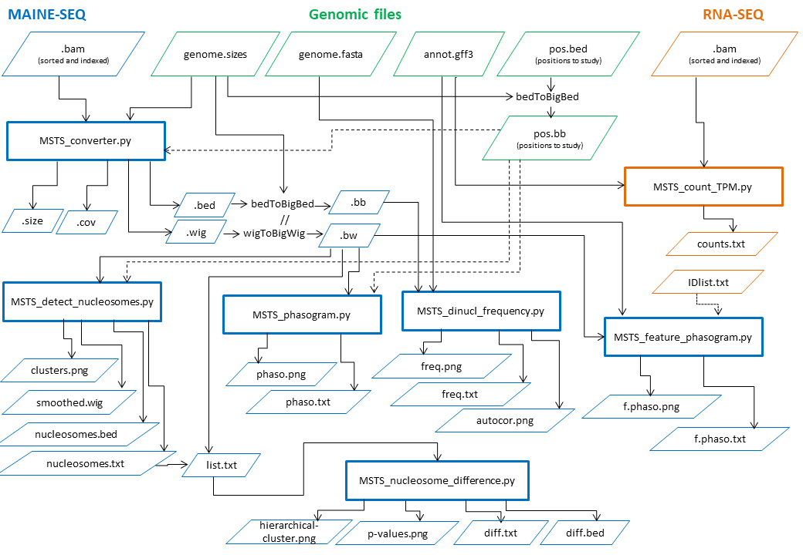

# MSTS: MAINE-Seq Tool Suite

MSTS has been developed to analyse NGS data in the frame of MAINE-Seq experiments and to propose some utilities to draw graph and perform simple statistics on your data.

MSTS is developed by the BioinfoBIOGER plateform (N.Lapalu, A.Simon) at [INRA-BIOGER](http://www.versailles-grignon.inra.fr/bioger). Please do not hesitate to contact us (nlapalu at inra dot fr) if you have any comments or questions.

# Table of contents

* [Requirements](#requirements)
* [Installation](#installation)
* [Tool documentations](#tool-documentations)
* [Protocole to analyze MAINE-Seq data](#protocole-to-analyze-maine-seq-data)
	* [Introduction](#introduction)
	* [Mapping sequencing reads](#mapping-sequencing-reads)
	* [Draw phasogram and get nucleosome spacing](#draw-phasogram-and-get-nucleosome-spacing)
		* [Analysis at the genome scale](#analysis-at-the-genome-scale)
		* [Analysis of feature specificity](#analysis-of-feature-specificity)
	* [Draw feature specific phasogram](#draw-feature-specific-phasogram)
	* [Analyze relation between Transcript Expression level and nucleosome occupancy](#analyze-relation-between-transcript-expression-level-and-nucleosome-occupancy)
	* [Detect and classify nucleosomes](#detect-and-classify-nucleosomes)
	* [Analyze di-nucleotide composition](#analyze-di-nucleotide-composition)
		* [From mapped reads](#from-mapped-reads) 
		* [From detected nucleosome positions](from-detected-nucleosome-positions)
	* [Differential signal analysis](#differential-signal-analysis)
* [References](#references)


## Dependencies and external tools

### External tools

* samtools
* wigToBigWig (Kent's tools)
* bedToBigBed (Kent's tools)

## Install  (DEV mode !!!)

### Prerequesites:

* numpy
* scipy
* scikit-learn
* fastcluster (http://danifold.net/fastcluster.html)
* matplotlib
* pysam
* pyBigWig

### Download

```
wget https://github.com/nlapalu/MSTS/archive/develop.zip
unzip develop.zip
cd MSTS-develop/
```

### Test the code

### Install as root

### Install as user

```
python setup.py install --prefix=/home/nlapalu/test/MSTS
export PYTHONPATH=/home/nlapalu/test/MSTS/lib/python2.7/site-packages/
export PATH=$PATH:/home/nlapalu/test/MSTS/bin
```

# Protocole to analyze MAINE-Seq data

## Introduction

some comments on mapping step ...

some comments on quality criteria and metrics / graph to control quality

## Mapping sequencing reads

Be sure your mapping file is sorted and indexing, if not:

`samtools sort mapping.bam > mapping.sorted.bam`

`samtools index mapping.sorted.bam `

then:

### For single reads

`MSTS_converter.py mapping.sorted.bam -m single-expanded -p mapping -g assembly.genome --wig --size`

#### For paired reads

`MSTS_converter.py mapping.sorted.bam -m fragment-middle -w 20 -p mapping -g assembly.genome --wig --size --bed`

### Convert wig file to bigWig file

`wigToBigWig mapping.wig assembly.genome mapping.bw`

## Draw phasogram and get nucleosome spacing 

### Analysis at the genome scale

One of the first common thing to do after the mapping is the phasogram of your data. This graph highlights the nucleosome arrangement on the genome and the average spacing between two nucleosomes. 

`MSTS_phasogram.py mapping.bw -w 1000 -o mapping.phasogram.png -t "phasogram - mapping" -v 2 --flush --regression > mapping.phaso`

<div align="center"></div>

As we can see, the distance between two nucleosome summits is estimated close to 164bp with a standard deviation of 2,3bp. So, with a size of 147bp for a nucleosome fixation, we can propose an average spacing of 18 nucleotides between nucleosomes. We recommend not to exceed 1kb as analyzed window. Beyond this value, the signal becomes less reliable.

### Analysis of feature specificity

In case of genome specificity (high AT content, AT isochore, different chromosome composition, ...), you can limit the phasogram to specific regions. Below we limited the analysis to genes. We can observe that the standard deviation is reduced, the spacing between nucleosome is less variable compare to the entire genome.

`MSTS_phasogram.py /work/spe_nucleosome/Lepto/MAINE-Seq/publi/converter/Lmb/mapping_40.bw -w 1000 -o mapping.phasogram.png -t "phasogram - mapping" -v 2 --flush --regression -b genes.bb > mapping.phaso`

<div align="center"></div>

## Draw feature specific phasograms

We also propose a "phasogram like" graph, that show the cumulative signal on specific features. The "context" option limits the graph to the desired bases, no spanning feature or base outside of the feature. For example, if you wish to analyze 1kb before and after the Transcription Start Sites (TSS), but some adjacent TSS are closer than 1kb, we remove bases spanning the new TSS to avoid bias. The number of bases taken into account to draw the signal are plotted as an histogram on the graph. We provide another histogram in the upper area with adjacent features of the same type. This option is usefull for small genomes with short intergenic regions. 

__*Analysis of TSS:*__

`MSTS_feature_phasogram.py mapping.bw genes.gff3 -v 2 -o featurephasogram.TSS.png -t "TSS, with context, with smoothing" -p start -ft mRNA --context --GaussianSmoothing`

__*Analysis of TTS:*__

`MSTS_feature_phasogram.py mapping.bw genes.gff3 -v 2 -o featurephasogram.TTS.png -t "TTS, with context, with smoothing" -p end -ft mRNA --context --GaussianSmoothing`


You can perform the same analysis on all the feature types available in your gff file.

## Analyze relation between Transcript Expression level and nucleosome occupancy

If you have RNA-Seq data and MAINE-Seq data, you could draw phasograms with intervals of expression levels

Generate TPM count file from RNA-Seq mapped data (sorted, indexed bam) and annotation file

`MSTS_count_TPM.py RNA_mapping.sorted.bam genes.gff3 -v 2 > counts.tpm`

Export transcript list of IDs for defined Expression Level intervals (x>50,50>=x>5,5>=x>1,x<=1)

```
tail -n+2 counts.tpm | awk -F"\t" '{if($5 > 50){print $1}}' > 50.tpm 

tail -n+2 counts.tpm | awk -F"\t" '{if($5 <= 50 && $5 > 5){print $1}}' > 50-5.tpm 

tail -n+2 counts.tpm | awk -F"\t" '{if($5 <= 5 && $5 > 1){print $1}}' > 5-1.tpm 

tail -n+2 counts.tpm | awk -F"\t" '{if($5 < 1){print $1}}' > 1.tpm 
```

Generate phasogram for each list

```
MSTS_feature_phasogram.py mapping.bw genes.gff3 -v 2 -o myfeaturestartphasogram50.png -t "phasogram on transcript, start as pivot, TPM > 50"  -ft mRNA -l 50.tpm --context --GaussianSmoothing --flush > 50.tpm.phaso

MSTS_feature_phasogram.py mapping.bw genes.gff3 -v 2 -o myfeaturestartphasogram50-5.png -t "phasogram on transcript, start as pivot, 50>TPM>5"  -ft mRNA -l 50-5.tpm --context --GaussianSmoothing --flush > 50-5.tpm.phaso

MSTS_feature_phasogram.py mapping.bw genes.gff3 -v 2 -o myfeaturestartphasogram5-1.png -t "phasogram on transcript, start as pivot, 5>TPM>1"  -ft mRNA -l 5-1.tpm --context --GaussianSmoothing --flush > 5-1.tpm.phaso

MSTS_feature_phasogram.py mapping.bw genes.gff3 -v 2 -o myfeaturestartphasogram1.png -t "phasogram on transcript, start as pivot, TPM < 1"  -ft mRNA -l 1.tpm --context --GaussianSmoothing --flush > 1.tpm.phaso
```


With the '--flush' option, you can export the data to merge all phasograms on single one as below. [Here](doc/MergedPhasogram.md) you will find a piece of code to generate the "merged phasogram". 

<div align="center"></div>


## Detect and classify nucleosomes

For most of available tools, the nucleosome detection and positioning are based on a simply greedy approach that consist for each sequence:
- descending sort of occupancy values for each position
- defining nucleosome positions from the highest occupancy value to the lowest with a constraint of 147bp.
- limiting peak detection to a min/max coverage

More sophiscated tool, defined TBB (ref), that allow several positions for the same nucleosome ... 

In your case, we decided to keep the conventional protocole to define an average position, allowing a possible overlap between nucleosome in case of fuzzy area (30bp by default). Moreover, we perform a clustering and classification to propose confidence level in nucleosome positioning. We define 4 categories: "very-well", "well", "fuzzy" and "bad" positioned. 

`MSTS_detect_nucleosomes.py mapping.bw -p detection --bed --wig `

You get the list of detected nucleosomes in __detection_nucleosomes.txt__ 

```
seq     start   end     mean    stdev   peak    cluster positioning
SEQ01  13      159     8.0     4.25544868814   12.0    2       well
SEQ01  1982    2128    8.02040816327   2.78105688263   10.0    4       fuzzy
SEQ01  2355    2501    8.99319727891   1.9743132747    11.0    6       fuzzy
SEQ01  3249    3395    15.6666666667   4.47568386191   22.0    3       fuzzy
SEQ01  3387    3533    19.3605442177   6.35347200407   31.0    4       fuzzy
SEQ01  3504    3650    16.9183673469   4.30710566845   20.0    6       fuzzy
SEQ01  3670    3816    28.0476190476   11.419242224    41.0    4       fuzzy
SEQ01  3840    3986    12.3333333333   4.32101860839   17.0    4       fuzzy
SEQ01  4015    4161    10.0272108844   3.94165885558   17.0    4       fuzzy
SEQ01  4230    4376    20.7278911565   4.53190927482   27.0    6       fuzzy
SEQ01  4457    4603    29.4897959184   10.7477998678   47.0    4       fuzzy
SEQ01  4624    4770    42.4693877551   10.7540886845   54.0    3       fuzzy
SEQ01  4781    4927    35.0068027211   6.49698684597   44.0    3       fuzzy
SEQ01  4973    5119    39.2448979592   14.868398592    60.0    0       fuzzy
SEQ01  5103    5249    24.8707482993   7.21041584924   32.0    3       fuzzy
SEQ01  5269    5415    18.4489795918   3.76916178897   16.0    3       fuzzy
SEQ01  5387    5533    28.2517006803   7.58161357856   41.0    3       fuzzy
SEQ01  5557    5703    29.1972789116   13.2596464466   49.0    2       well
SEQ01  5707    5853    32.8843537415   11.6487814357   48.0    4       fuzzy
SEQ01  5904    6050    53.3333333333   21.8162809245   91.0    4       fuzzy
SEQ01  6071    6217    44.4557823129   9.44099563275   60.0    3       fuzzy
SEQ01  6277    6423    37.8979591837   12.0106158791   57.0    4       fuzzy
SEQ01  6473    6619    45.2380952381   20.1052784667   75.0    2       well
SEQ01  6634    6780    40.1020408163   24.3066393589   79.0    2       well
SEQ01  6817    6963    55.768707483    30.0518979733   103.0   2       well
...
```

The mean is computed with occupancy value for all positions of the defined nucleosome (147 bp long).

For further analysis or visualization, the --bed option exports positioned nucleosomes per cluster and the --wig option exports the smoothed signal used to classify occupancy values.
We also export the clustering as a cartoon to easily visualize the average profile of each cluster.


If you find few very-well, well positioned and a remarkably number of fuzzy, you can try the --refine option, that will relaunch a clustering on fuzzy positioned with a relaxed classification. See below the upper analysis with a refined clustering.

 

## Analyze di-nucleotide composition

The di-nucleotide pattern AT/GC with a frequence of 10 bp for nucleosome fixation site has been largely described (ref) and proposed to be used as data quality control (*S.Hu et al. 2017*). You can perform a such analysis on your mapping data converted in bigBed file with MSTS_converter.py

### From mapped reads 

```
# convert your mapping bed file to bigBed and run MSTS_dinuc_frequency
bedToBigBed mapping.bed assembly.genome mapping.bb
MSTS_dinuc_frequency.py mapping.bb 
```

 

### From detected nucleosome positions

You can also control your nucleosome detection and classification with this tool. We expect a better signal for well positioned nucleosome compare to bad/loosely positioned. To do that run MSTS_detect_nucleosomes.py with --bed option and convert them to bigBed. We present below the dinucleotide frequency analyzed for 4 types of clusters (bad, fuzzy, well, very-well):

__*bad positioned nucleosomes:*__

`python MSTS_dinuc_frequency.py genome.fasta detect.k1-bad.cluster.sorted.bb --pAutocorMix --pFreqNormMix -p detect_dinuc_bad -ami -65 -amx 65`

 

__*fuzzy positioned nucleosomes:*__

`python MSTS_dinuc_frequency.py genome.fasta detect.k2-fuzzy.cluster.sorted.bb --pAutocorMix --pFreqNormMix -p detect_dinuc_fuzzy -ami -65 -amx 65`

 

__*well positioned nucleosomes:*__

`python MSTS_dinuc_frequency.py genome.fasta detect.k3-well.cluster.sorted.bb --pAutocorMix --pFreqNormMix -p detect_dinuc_well -ami -65 -amx 65`

 

__*very-well positioned nucleosomes:*__

`python MSTS_dinuc_frequency.py genome.fasta detect.k4-very-well.cluster.sorted.bb --pAutocorMix --pFreqNormMix -p detect_dinuc_very-well -ami -65 -amx 65`

 


## Differential signal analysis

We propose a simple  


# Tool documentations

* [MSTS_converter.py](doc/MSTS_converter.md)
* [MSTS_phasogram.py](doc/MSTS_phasogram.md)
* [MSTS_feature_phasogram.py](doc/MSTS_feature_phasogram.md)
* [MSTS_count_TPM.py](doc/MSTS_count_TPM.md)
* [MSTS_dinuc_frequency.py](doc/MSTS_dinuc_frequency.md)
* [MSTS_detect_nucleosomes.py](doc/MSTS_detect_nucleosomes.md)

## MSTS overview



# References

* S. Hu, X. Chen, J. Liao, Y. Chen, C. Zhao, and Y. Zhang, “CAM: A quality control pipeline for MNase-seq data,” PLoS One, vol. 12, no. 8, p. e0182771, Aug. 2017.

