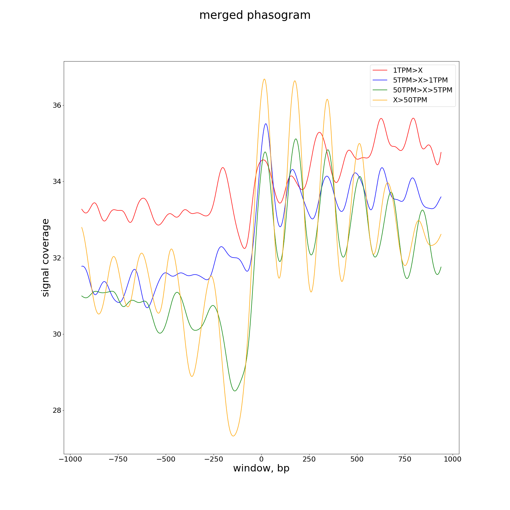

# MSTS: MAINE-Seq Tool Suite

MSTS has been developed to analyze NGS data obtained from MAINE-Seq experiments and provide utilities to perform simple statistics and to plot results.

MSTS is developed by the BioinfoBIOGER plateform (N.Lapalu, A.Simon) at [INRAE-BIOGER](http://www.versailles-grignon.inra.fr/bioger). Please do not hesitate to contact us (nicolas.lapalu at inrae dot fr) if you have any comments or questions.

# Table of contents

* [Installation](#installation)
	* [Prerequisites](#prerequisites)
	* [Basic installation](#basic-installation)
	* [Dependencies and external tools](#dependencies-and-external-tools)
* [Tool documentation](#tool-documentation)
* [Protocol to analyze MAINE-Seq data](#protocol-to-analyze-maine-seq-data)
	* [Process mapped sequencing reads](#process-mapped-sequencing-reads)
	* [Draw phasogram and get nucleosome spacing](#draw-phasogram-and-get-nucleosome-spacing)
		* [Genome-wide analysis](#genome-wide-analysis)
		* [Compartment-specific analysis](#compartment-specific-analysis)
	* [Draw feature-specific phasogram](#draw-feature-specific-phasogram)
	* [Explore relationship between Transcript Expression level and nucleosome occupancy](#explore-relationship-between-transcript-expression-level-and-nucleosome-occupancy)
	* [Detect and categorize nucleosomes](#detect-and-categorize-nucleosomes)
	* [Differential signal analysis](#differential-signal-analysis)
	* [Analyze di-nucleotide composition](#analyze-di-nucleotide-composition)
		* [From mapped reads](#from-mapped-reads) 
		* [From detected nucleosome positions](from-detected-nucleosome-positions)
* [References](#references)


# Installation

## Prerequisites

Python 3.X (tested with 3.7)

Packages:

* numpy
* scipy
* scikit-learn
* fastcluster (http://danifold.net/fastcluster.html)
* matplotlib
* pysam
* pyBigWig

To install required packages download the requirements and launch:

`pip install -r requirements.txt`

## Basic installation

`pip install https://github.com/nlapalu/MSTS/archive/master.zip`

## Dependencies and external tools

* samtools
* wigToBigWig [Kent's tools](https://github.com/ENCODE-DCC/kentUtils)
* bedToBigBed [Kent's tools](https://github.com/ENCODE-DCC/kentUtils)


# Protocol to analyze MAINE-Seq data

## Process mapped sequencing reads

The tool of your choice can be used to map sequencing reads as long as the output is in bam format. Make sure your mapping file is sorted by position and indexed before using MSTS. To sort and index bam files run: 

`samtools sort mapping.bam > mapping.sorted.bam`

`samtools index mapping.sorted.bam `

Then use the MSTS converter to process bam files:

#### For single reads

`MSTS_converter.py mapping.sorted.bam -m single-expanded -p mapping -g assembly.genome --wig --size`

#### For paired reads

`MSTS_converter.py mapping.sorted.bam -m fragment-middle -w 20 -p mapping -g assembly.genome --wig --size --bed`

#### Convert wig file to bigWig file

`wigToBigWig mapping.wig assembly.genome mapping.bw`

## Draw phasogram and get nucleosome spacing 

### Genome-wide analysis

One of the first things to do for primary data exploration is to plot a phasogram  derived from your data. This graph highlights general nucleosome arrangement on the genome and the average spacing between two nucleosomes. 

`MSTS_phasogram.py mapping.bw -w 1000 -o mapping.phasogram.png -t "phasogram - mapping" -v 2 --flush --regression > mapping.phaso`

<div align="center"></div>

In this example, the phasogram reveals an average distance between two nucleosome summits of nearly 164 bp, with a standard deviation of 2.3 bp. Thus, considering a size of 147 bp for the length of nucleosome-bound DNA, an average spacing of 18 nucleotides between nucleosomes can be proposed. We recommend window of 1kb as one-fits starting point. Beyond this value, the signal could become less reliable with some datasets.


### Compartment-specific analysis

In case of needing to restrict the analysis to particular genome compartments, *e.g.*, with specific characteristics such as high AT content or exon only, you can limit the phasogram analysis to chosen regions. An example of analysis restricted to genes is provided below. We can observe that standard deviation is reduced, indicating spacing between nucleosome is less variable within genes than when the entire genome is considered.


`MSTS_phasogram.py mapping.bw -w 1000 -o mapping.phasogram.png -t "phasogram - mapping" -v 2 --flush --regression -b genes.bb > mapping.phaso`

<div align="center"></div>

## Draw feature-specific phasograms

We also propose a "phasogram like" graph, that show the cumulative signal on specific features. The "context" option limits the graph to the desired bases, no spanning feature or base outside of the feature. For example, if you wish to analyze 1kb before and after the Transcription Start Sites (TSS), but some adjacent TSS are closer than 1kb, we remove bases spanning the new TSS to avoid bias. The number of bases taken into account to draw the signal are plotted as an histogram on the graph. We provide another histogram in the upper area with adjacent features of the same type. This option is usefull for small genomes with short intergenic regions. 

We also propose to plot "phasogram-like" graphs that show cumulative signal on specific features. The "context" option limits the data to be considered for plotting to the nucleotides concerned by the feature option without hitting any nearby feature. For example, if you wish to analyze 1 kb upstream and 1 kb downstream Transcription Start Sites (TSS), the "context" option will perform the analysis using up to 1 kb on each side, cutting out any eventual adjacent mRNA found closer than 1kb to avoid bias. The number of nucleotides actually taken into account to draw the signal is then plotted as a histogram (grey area) on the graph. Another histogram is also provided in the upper area representing the number of adjacent features of the same type at each position of the studied window. This option is particularly useful for small genomes with short intergenic regions. The context ifilter works on any type of feature defined with the "featureType" option.

__*Analysis of TSS:*__

`MSTS_feature_phasogram.py mapping.bw genes.gff3 -v 2 -o featurephasogram.TSS.png -t "TSS, with context, with smoothing" -p start -ft mRNA --context --GaussianSmoothing`

__*Analysis of TTS:*__

`MSTS_feature_phasogram.py mapping.bw genes.gff3 -v 2 -o featurephasogram.TTS.png -t "TTS, with context, with smoothing" -p end -ft mRNA --context --GaussianSmoothing`


You can perform the same analysis on all the feature types available in your gff file.

## Explore relationship between Transcript Expression level and nucleosome occupancy

If you have RNA-Seq data and MAINE-Seq data, you could draw phasograms on genes (or other relevant feature) grouped by expression levels. To do so, you have to defined a list of features to which the analysis will be limited.

If you do not have counts on your features, you can generate TPM count file from RNA-Seq mapped data (sorted and indexed bam) and annotation fil :

`MSTS_count_TPM.py RNA_mapping.sorted.bam genes.gff3 -v 2 > counts.tpm`

Export list of transcripts IDs for each defined Expression Level intervals, *e.g* [x>50,50>=x>5,5>=x>1,x<=1].

```
tail -n+2 counts.tpm | awk -F"\t" '{if($5 > 50){print $1}}' > 50.tpm 

tail -n+2 counts.tpm | awk -F"\t" '{if($5 <= 50 && $5 > 5){print $1}}' > 50-5.tpm 

tail -n+2 counts.tpm | awk -F"\t" '{if($5 <= 5 && $5 > 1){print $1}}' > 5-1.tpm 

tail -n+2 counts.tpm | awk -F"\t" '{if($5 < 1){print $1}}' > 1.tpm 
```

Generate phasograms restricting the analysis to genes on each list

```
MSTS_feature_phasogram.py mapping.bw genes.gff3 -v 2 -o myfeaturestartphasogram50.png -t "phasogram on transcript, start as pivot, TPM > 50"  -ft mRNA -l 50.tpm --context --GaussianSmoothing --flush > 50.tpm.phaso

MSTS_feature_phasogram.py mapping.bw genes.gff3 -v 2 -o myfeaturestartphasogram50-5.png -t "phasogram on transcript, start as pivot, 50>TPM>5"  -ft mRNA -l 50-5.tpm --context --GaussianSmoothing --flush > 50-5.tpm.phaso

MSTS_feature_phasogram.py mapping.bw genes.gff3 -v 2 -o myfeaturestartphasogram5-1.png -t "phasogram on transcript, start as pivot, 5>TPM>1"  -ft mRNA -l 5-1.tpm --context --GaussianSmoothing --flush > 5-1.tpm.phaso

MSTS_feature_phasogram.py mapping.bw genes.gff3 -v 2 -o myfeaturestartphasogram1.png -t "phasogram on transcript, start as pivot, TPM < 1"  -ft mRNA -l 1.tpm --context --GaussianSmoothing --flush > 1.tpm.phaso
```


The '--flush' option, allows exporting the to be used to merge all phasograms on a single figure as below, with `MSTS_merge_phasograms.py`. [Here](doc/MSTS_merge_phasograms.md) you will find a piece of code to generate the "merged phasogram". 

<div align="center"></div>


## Detect and categorize nucleosomes

For most of available tools, the nucleosome detection and positioning are based on a simple greedy approach that consists for each sequence in:
- descending sort of occupancy values for each position
- defining nucleosome positions from the highest occupancy value to the lowest with a constraint of 147bp.
- limiting peak detection to a min/max coverage

More sophiscated tool, defined TBB (*Zhou et al. 2016*), that allow several positions for the same nucleosome, instead of a signal consensus.  For MSTS, we decided to keep the conventional protocol to define an average position for a given nucleosome, allowing overlaps between nucleosomes for cases of 'fuzzy' regions (30ba-long overlap max by default). Then, MSTS perform a clustering and classification to provide an indication of the confidence level in nucleosome positioning. We defined 4 categories of positioned nucleosomes: "very-well", "well", "fuzzy" and "bad". 

Typical command to run:

`MSTS_detect_nucleosomes.py mapping.bw -p detection --bed --wig `

Example of the output below:

```
seq     start   end     mean    stdev   peak    cluster positioning
SEQ01  13      159     8.0     4.25544868814   12.0    2       well
SEQ01  1982    2128    8.02040816327   2.78105688263   10.0    4       fuzzy
SEQ01  2355    2501    8.99319727891   1.9743132747    11.0    6       fuzzy
SEQ01  3249    3395    15.6666666667   4.47568386191   22.0    3       fuzzy
SEQ01  3387    3533    19.3605442177   6.35347200407   31.0    4       fuzzy
SEQ01  3504    3650    16.9183673469   4.30710566845   20.0    6       fuzzy
SEQ01  3670    3816    28.0476190476   11.419242224    41.0    4       fuzzy
SEQ01  3840    3986    12.3333333333   4.32101860839   17.0    4       fuzzy
SEQ01  4015    4161    10.0272108844   3.94165885558   17.0    4       fuzzy
SEQ01  4230    4376    20.7278911565   4.53190927482   27.0    6       fuzzy
SEQ01  4457    4603    29.4897959184   10.7477998678   47.0    4       fuzzy
SEQ01  4624    4770    42.4693877551   10.7540886845   54.0    3       fuzzy
SEQ01  4781    4927    35.0068027211   6.49698684597   44.0    3       fuzzy
SEQ01  4973    5119    39.2448979592   14.868398592    60.0    0       fuzzy
SEQ01  5103    5249    24.8707482993   7.21041584924   32.0    3       fuzzy
SEQ01  5269    5415    18.4489795918   3.76916178897   16.0    3       fuzzy
SEQ01  5387    5533    28.2517006803   7.58161357856   41.0    3       fuzzy
SEQ01  5557    5703    29.1972789116   13.2596464466   49.0    2       well
SEQ01  5707    5853    32.8843537415   11.6487814357   48.0    4       fuzzy
SEQ01  5904    6050    53.3333333333   21.8162809245   91.0    4       fuzzy
SEQ01  6071    6217    44.4557823129   9.44099563275   60.0    3       fuzzy
SEQ01  6277    6423    37.8979591837   12.0106158791   57.0    4       fuzzy
SEQ01  6473    6619    45.2380952381   20.1052784667   75.0    2       well
SEQ01  6634    6780    40.1020408163   24.3066393589   79.0    2       well
SEQ01  6817    6963    55.768707483    30.0518979733   103.0   2       well
...
```

The mean is computed with occupancy value for all positions of the defined nucleosome (147 bp in length).

For further analysis or visualization, the --bed option exports positioned nucleosomes per cluster and the --wig option exports the smoothed signal used to classify occupancy values.
We also export the clustering as a cartoon to easily visualize the average profile of each cluster.


If you find few very-well and, well positioned nucleosomes and a remarkably high number of fuzzy nuclesomes, you can try the --refine option, that will relaunch a clustering on the fuzzy class with a relaxed classification. See below the example of the upper analysis re-done with a refined clustering.

 


## Differential signal analysis

We propose a simple approach to analyze differences between 2 conditions. We only analyze positions detected as potential dyad of nucleosomes, with a possible filter on the reliability of each type of nucleosome positioning (default=fuzzy). We use a Poisson distribution with a lambda equals to the normalized peak occupancy for each condition. Then we use a test ratio for two Poisson rates followed by a Benjamini-Hochberg correction for multiple tests. The default normalization method is quantile, but a global scaling (scaling factor defined with the average of number reads in all replicats) is also available.
In case of multiple replicates, we provide a dendogram of hierarchical clustering to control the homogeneity of replicates. In the same manner, the p-value plot allows you to validate the expected results.
The user must provide a design file with link to all required files. 

__*design file:*__

```
#condition	label	nucfile	bigwigfile
c1	43	43.nucleosomes.txt	43.mapping.bw
c1	44	44.nucleosomes.txt	44.mapping.bw
c1	45	45.nucleosomes.txt	45.mapping.bw
c2	46	46.nucleosomes.txt	46.mapping.bw
c2	47	47.nucleosomes.txt	47.mapping.bw
c2	48	48.nucleosomes.txt	48.mapping.bw
```

`MSTS_nucleosome_difference.py design.txt -v 2 -p C1vsC2 -f 2.0 -a 0.05 --bed --merge` 

__*result file:*__

We only export positions with potential difference in signal with 
defined thresholds (default: FC=2.0 and alpha=0.05).

```
#ref	pos	mean1	CV1	mean2	CV2	FC	pval	paj
SEQ10	708598	16.2	21.9	2.7	48.7	0.16	7.12e-08	7.45e-06
SEQ14	253307	13.9	22.5	2.7	31.9	0.19	1.64e-06	8.95e-05
SEQ18	129813	14.2	40.1	2.9	10.9	0.20	2.25e-06	1.14e-04
SEQ18	125906	29.6	55.5	6.1	21.4	0.20	8.39e-12	4.10e-09
SEQ12	30014	10.7	37.7	2.2	74.1	0.21	4.28e-05	1.07e-03
SEQ18	125912	30.2	69.4	6.3	7.6	0.21	7.18e-12	3.60e-09
SEQ05	2586933	10.6	20.9	2.3	52.2	0.21	5.81e-05	1.35e-03
SEQ16	436879	72.4	26.0	15.7	22.7	0.22	1.10e-25	5.24e-22
SEQ01	3531964	50.8	22.2	11.1	5.0	0.22	2.14e-18	5.00e-15
SEQ18	125909	30.1	63.3	6.7	16.2	0.22	2.66e-11	1.09e-08
...
```


__*companion plots*__

_hierarchical clustering_:

 

_p-values plot_:

 

## Analyze di-nucleotide composition

The di-nucleotide pattern AT/GC with a frequency of 10 bp for nucleosome fixation site has been largely described and proposed to be used as data quality control (*S.Hu et al. 2017*). You can perform such analysis on your mapping output converted in bigBed file with MSTS_converter.py

### From mapped reads 

```
# convert your mapping bed file to bigBed and run MSTS_dinuc_frequency
bedToBigBed mapping.bed assembly.genome mapping.bb
MSTS_dinuc_frequency.py assembly.fasta mapping.bb 
```

 

### From detected nucleosome positions

You can also control your nucleosome detection and classification with this tool. We expect a better signal for well positioned compared to badly/loosely positioned nucleosomes. To do this, run MSTS_detect_nucleosomes.py with --bed option and convert them to bigBed. We present below dinucleotide frequency profiles analyzed for 4 types of clusters (bad, fuzzy, well, very-well):

__*badly positioned nucleosomes:*__

`MSTS_dinuc_frequency.py genome.fasta detect.k1-bad.cluster.sorted.bb --pAutocorMix --pFreqNormMix -p detect_dinuc_bad -ami -65 -amx 65`

 

__*fuzzily positioned nucleosomes:*__

`MSTS_dinuc_frequency.py genome.fasta detect.k2-fuzzy.cluster.sorted.bb --pAutocorMix --pFreqNormMix -p detect_dinuc_fuzzy -ami -65 -amx 65`

 

__*well positioned nucleosomes:*__

`MSTS_dinuc_frequency.py genome.fasta detect.k3-well.cluster.sorted.bb --pAutocorMix --pFreqNormMix -p detect_dinuc_well -ami -65 -amx 65`

 

__*very-well positioned nucleosomes:*__

`MSTS_dinuc_frequency.py genome.fasta detect.k4-very-well.cluster.sorted.bb --pAutocorMix --pFreqNormMix -p detect_dinuc_very-well -ami -65 -amx 65`

 

# Tool documentations

* [MSTS_converter.py](doc/MSTS_converter.md)
* [MSTS_phasogram.py](doc/MSTS_phasogram.md)
* [MSTS_feature_phasogram.py](doc/MSTS_feature_phasogram.md)
* [MSTS_count_TPM.py](doc/MSTS_count_TPM.md)
* [MSTS_dinuc_frequency.py](doc/MSTS_dinuc_frequency.md)
* [MSTS_detect_nucleosomes.py](doc/MSTS_detect_nucleosomes.md)
* [MSTS_nucleosome_difference.py](doc/MSTS_nucleosome_difference.md)

## MSTS overview


# References

* S. Hu, X. Chen, J. Liao, Y. Chen, C. Zhao, and Y. Zhang, “CAM: A quality control pipeline for MNase-seq data,” PLoS One, vol. 12, no. 8, p. e0182771, Aug. 2017.
* X. Zhou, A. W. Blocker, E. M. Airoldi, and E. K. O’Shea, “A computational approach to map nucleosome positions and alternative chromatin states with base pair resolution.,” Elife, vol. 5, Sep. 2016.

