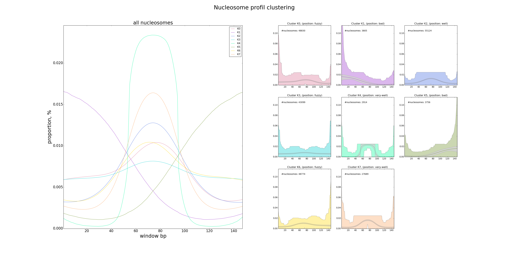

# MSTS_detect_nucleosomes.py

This tool detects and classifies nucleosomes from a bigWig file. Firstly, It performs a gaussian smoothing on the data. Then nucleosomes are detected with a greedy algorithm based on signal value and 147bp space constraint. Then It launches two clustering steps: 1/ a hierarchical clustering, done in several iterations with random subsets of data. This step defined the most probable number of clusters expected 2/ a KMeans clustering on all data with the previously defined number of cluster. 
Clusters are then exported in several formats (bed, wig).

## Usage and options

### Usage:

`MSTS_detect_nucleosomes.py input.bw`

or

`MSTS_detect_nucleosomes.py input.bw -p 'detect_nuc_sample' --wig --bed -v 3 -nbi 200 -nbn 1000` 


### Arguments:

| Argument | Description |
| --------- | ----------- |
| `bigWig` | mapping convert in bigWig file after MSTS_converter.py |

### Options:

| Option | Description |
| ------ | ----------- |
| `-w, --windowWidth` | window size for Gaussian smoothing, default=3 |
| `-sd, --stdev` | stdev for Gaussian smoothing, default=20 |
| `-b, --bigBed` | bigBedFile, use to limit detections to specific regions |
| `-p, --prefix` | prefix for output files, default=[out.] |
| `--wig` | output wig file |
| `--bed` | output bed files per cluster |
| `-df, --distanceFactor` | factor used to compute distance when iterating with hierarchical clustering, (factor_distance X max(distances) default=0.3, range[0.1-0.9] |
| `-nbi, --nbIterations` | nb iteration for hierarchical clustering, default=500 |
| `-nbn, --nbNucHC` | nb nucleosomes to sample for hierarchical clustering, default=2000 |
| `-t, --title` | title text |
| `-x, --xax` | x axis text |
| `-y, --yax` | y axis text |
| `-v, --verbosity` | increase output verbosity 1=error, 2=info, 3=debug |
| `--version` | tool version |
| `-h, --help` | help message |

## Inputs:

The bigWig file contains nucleosome signal obtained from mapping with MSTS_converter.py.

## Outputs:

#### prefix.nucleosomes.txt

```
seq     start   end     mean    stdev   peak    cluster positioning
SEQ1        397     544     8.95238095238   9.67663103609   4.0     5       bad
SEQ1        545     692     18.3401360544   18.1424809105   53.0    7       very-well
SEQ1        697     844     29.6394557823   31.0281736312   88.0    7       very-well
SEQ1        2493    2640    1.16326530612   1.75367763746   4.0     4       very-well
SEQ1        2652    2799    1.23129251701   1.70261114878   4.0     4       very-well
SEQ1        3632    3779    0.727891156463  0.861558650285  2.0     4       very-well
SEQ1        4804    4951    0.278911564626  0.448463938064  1.0     4       very-well
SEQ1        5364    5511    1.10884353741   1.17877632678   3.0     7       very-well
SEQ1        6187    6334    1.63945578231   1.62021909256   5.0     7       very-well
SEQ1        6480    6627    53.4489795918   34.6310355232   123.0   7       very-well
SEQ1        6627    6774    26.2721088435   22.0896620088   26.0    1       bad
SEQ1        6849    6996    47.9387755102   14.9116329012   73.0    6       fuzzy
SEQ1        7109    7256    39.2517006803   17.0029383365   40.0    3       fuzzy
SEQ1        7257    7404    42.3469387755   18.4193971484   74.0    2       well
SEQ1        7404    7551    34.6258503401   21.2968046801   53.0    0       fuzzy
...
```

#### cluster plot

After the K-Means clustering, we also generate a catoon with several plots. The main plot (on the right) displays the average profil for each detected clusters. On the left, there is a plot for each cluster with the average profil, the first and third quartile (gray) and the extrem values (specific color). We report also the number of nucleosomes affected to each cluster and the associated classification (very-well, well, fuzzy, bad).



#### wig file (--wig)

You get the smoothed wig file used to detect nucleosomes with a greedy approach.  

#### bed file (--bed)

You get a bed file per cluster. You can then load these bed files in your browser or use them to perform enrichment analysis.


