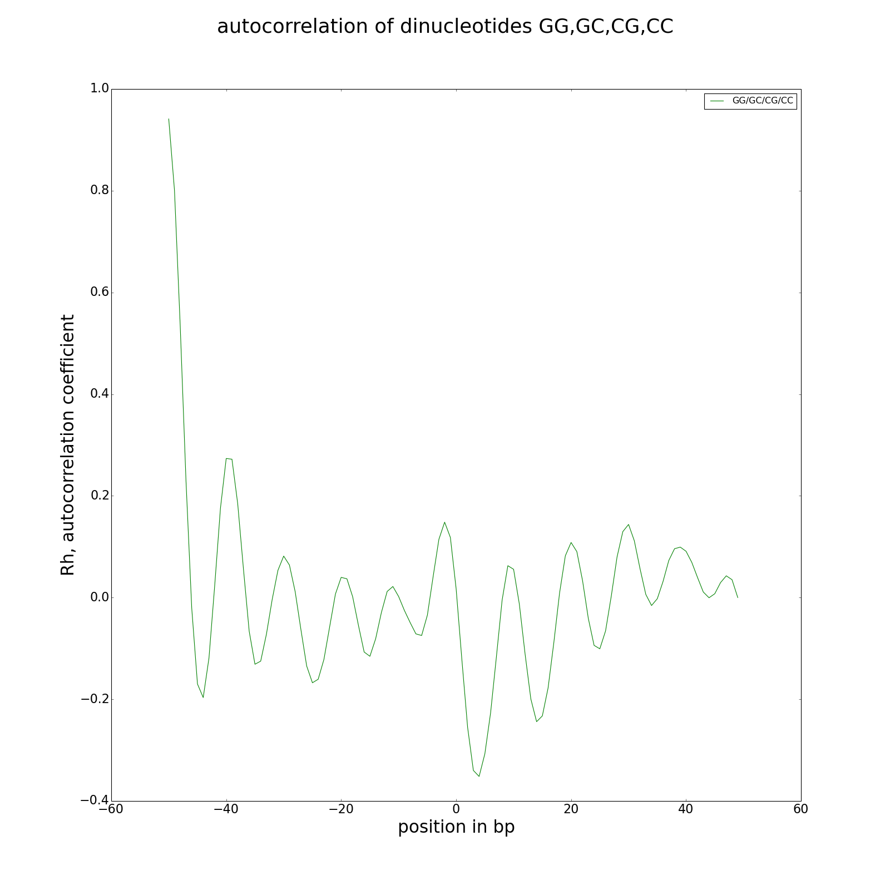
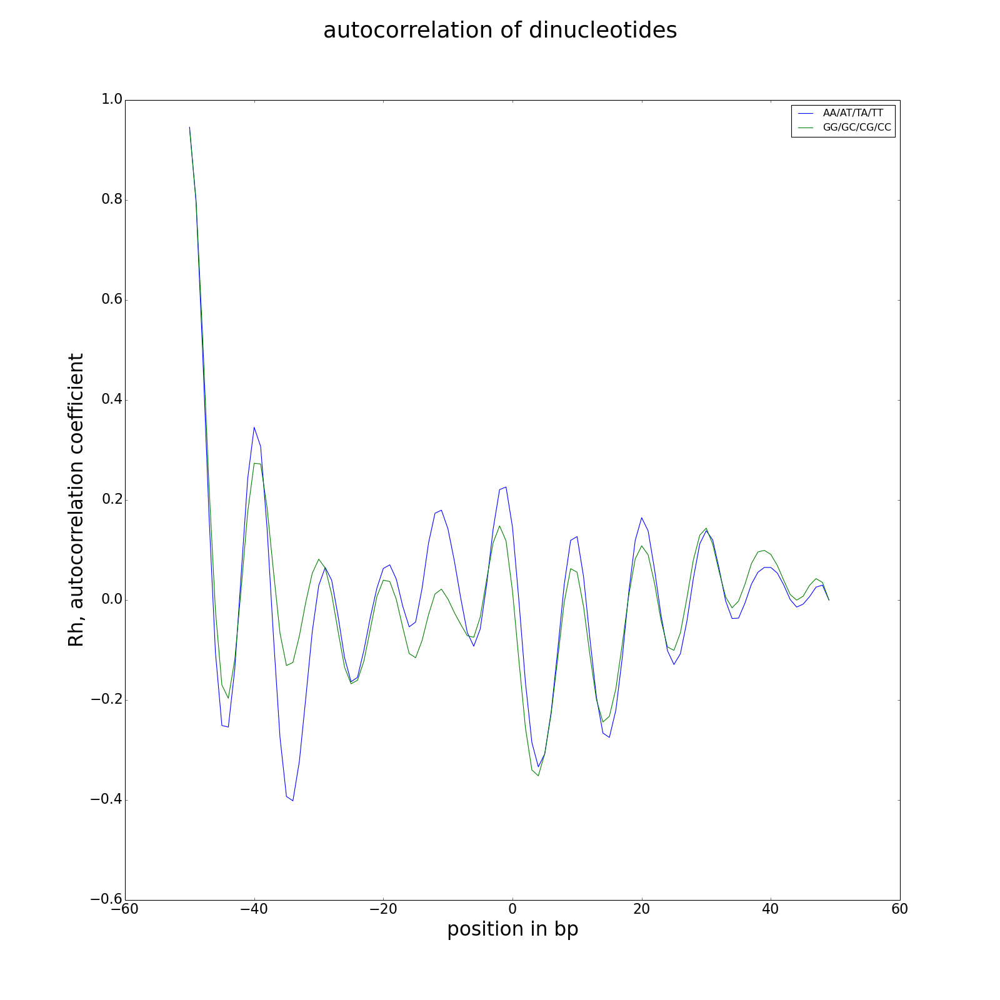

# MSTS_dinuc_frequency.py

blabla

## Usage and options

### Usage:

`MSTS_dinuc_frequency.py genome.fasta positions.bb`

or

`MSTS_dinuc_frequency.py genome.fasta positions.bb -v 2 --pFreq --pFreqNorm --pFreqNormMix --pAutocor --pAutocorMix --autocorMin "-50" --autocorMax "50" -p genome_dinuc --flush > frequencies.out` 


### Arguments:

| Argument | Description |
| --------- | ----------- |
| `FastaFile` | genome in fasta format |
| `BigBedFile` | nucleosome positions/centers in bigBed file |

### Options:

| Option | Description |
| ------ | ----------- |
| `-d, --distance` | distance to the center, default=70 |
| `--flush` | print frequencies on stdout to save to a file, > frequencies.out, default=False |
| `-p ,--prefix` | prefix use for plot file output name, default="freq" |
| `--pFreq` | print AT and GC frequencies plots, default=False |
| `--pFreqNorm` | print AT and GC Normalized frequencies plots, default=False |
| `--pFreqNormMix` | print AT and GC Normalized frequencies on single plot, default=False |
| `--pAutocor` | print AT and GC correlograms, default=False |
| `--pAutocorMix` | print AT and GC autocorrelation on single correlogram, default=False |
| `-ami, --autocorMin` | start for autocorrelation analysis, default=5 |
| `-amx, --autocorMax` | stop for autocorrelation analysis, default=35 |
| `-b, --buffer` | size of chunk (nb sequences) to keep in memory before analysis, default=1000000 |
| `-v, --verbosity` | increase output verbosity 1=error, 2=info, 3=debug |
| `--version` | tool version |
| `-h, --help` | help message |


## Inputs:

Fastafile is your assembly/genome in fasta format. The bigBed file contains nucleosome positions or read positions obtained from mapping. In case of paired end reads, positions are the fragment between R1 and R2 (see MSTS_converter.py). In case of single reads, you have to extend your reads from 5' to 3' up to 147 bp to fit with the nucleosome size (see MSTS_converter.py, "single-expanded").

## Outputs:

#### output on stdout (--flush)

Frequencies are written on stdout on demand.

```
pos         ATfreq          GCfreq        ATfreqNorm      GCfreqNorm
-70     NaN             NaN             NaN             NaN
-69     0.303407930825  0.208288547437  1.00272167464   0.99623221328
-68     0.307710764945  0.205900324258  1.01694195235   0.984809478362
-67     0.30861549929   0.205108119337  1.0199319755    0.981020407519
...
-1      0.297826671362  0.212067586527  0.984276376197  1.01430714118
0       0.297883033273  0.211858246252  0.984462644599  1.01330587861
1       0.299106096473  0.210760723343  0.988504701036  1.00805648929
...
67      0.305510609203  0.207153866491  1.00967073883   0.99080509919
68      0.300568368012  0.210439048043  0.993337308287  1.00651793472
69      0.293201245489  0.214802673601  0.968989976909  1.02738890627
70      NaN             NaN             NaN             NaN
```

#### frequency plots (--pFreq, --pFreqNorm, --pFreqNormMix)

**--pFreq** (AT, GC frequency plots)

 

**--pFreqNorm** (AT, GC average normalized frequency plots)

 

**--pFreqNormMix** (AT, GC average normalized frequencies on a unified plot)


#### autocorrelation, correlograms (--pAutocor, --pAutocorMix)

**--pAutocor** (AT, GC correlograms)

 

**--pAutocorMix** (AT, GC autocorrelation on a unified correlogram)


