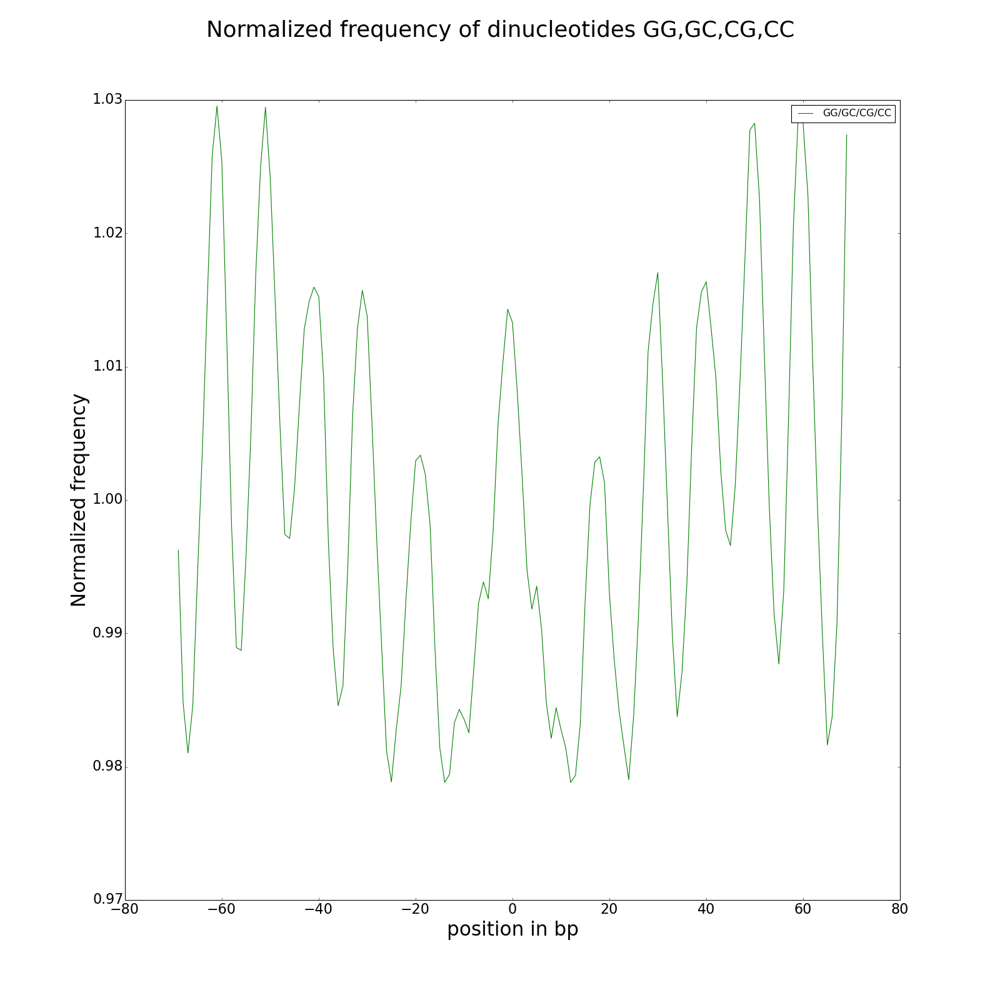

# MSTS_dinuc_frequency.py

blabla

## Usage and options

### Usage:

`MSTS_dinuc_frequency.py genome.fasta positions.bb`

or

`MSTS_dinuc_frequency.py genome.fasta positions.bb -v 2 --pFreq --pFreqNorm --pFreqNormMix --pAutocor --pAutocorMix --autocorMin "-50" --autocorMax "50" -p genome_dinuc --flush > frequencies.out` 

### Arguments:

| Argument | Description |
| --------- | ----------- |
| FastaFile | genome in fasta format |
| BigBedFile | nucleosome positions/centers in bigBed file |

### Options:

| Option | Description |
| ------ | ----------- |
| `-d, --distance` | distance to the center, default=70 |
| `--flush` | print frequencies on stdout to save to a file, > frequencies.out, default=False |
| `--pFreq` | print AT and GC frequencies plots, default=False |
| `-p ,--prefix` | prefix use for plot file output name, default="freq" |
| `--pFreqNorm` | print AT and GC Normalized frequencies plots, default=False |
| `--pFreqNormMix` | print AT and GC Normalized frequencies on single plot, default=False |
| `--pAutocor` | print AT and GC correlograms, default=False |
| `--pAutocorMix` | print AT and GC autocorrelation on single correlogram, default=False |
| `-ami, --autocorMin` | start for autocorrelation analysis, default=5 |
| `-amx, --autocorMax` | stop for autocorrelation analysis, default=35 |
| `-b, --buffer` | size of chunk (nb sequences) to keep in memory before analysis, default=1000000 |
| `-v, --verbosity` | increase output verbosity 1=error, 2=info, 3=debug |
| `--version` | tool version |
| `-h, --help` | help message |

## Inputs:

Fastafile is your assembly/genome in fasta format. The bigBed file contains nucleosome positions or read positions obtain from mapping. In case of paired end reads, positions are the fragment between R1 and R2 (see MSTS_converter.py). In case of single reads, you have to extend your reads from 5' to 3' up to 147 to fit with the nucleosome size (see MSTS_converter.py,not yet implemented).

## Outputs:

#### output on stdout (--flush)

#### frequency plots (--pFreq, --pFreqNorm, --pFreqNormMix)

--pFreq

 

--pFreqNorm

 

--pFreqNormMix

#### autocorrelation, correlograms (--pAutocor, --pAutocorMix)

