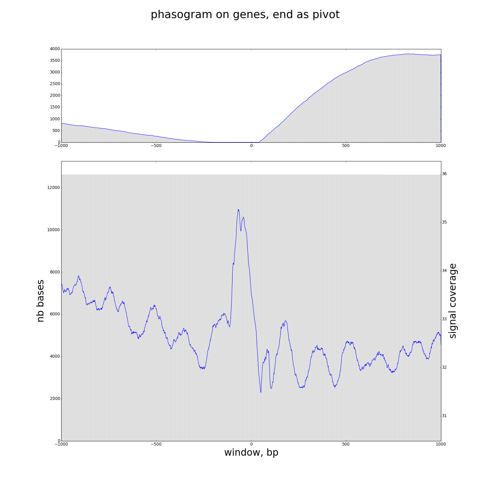
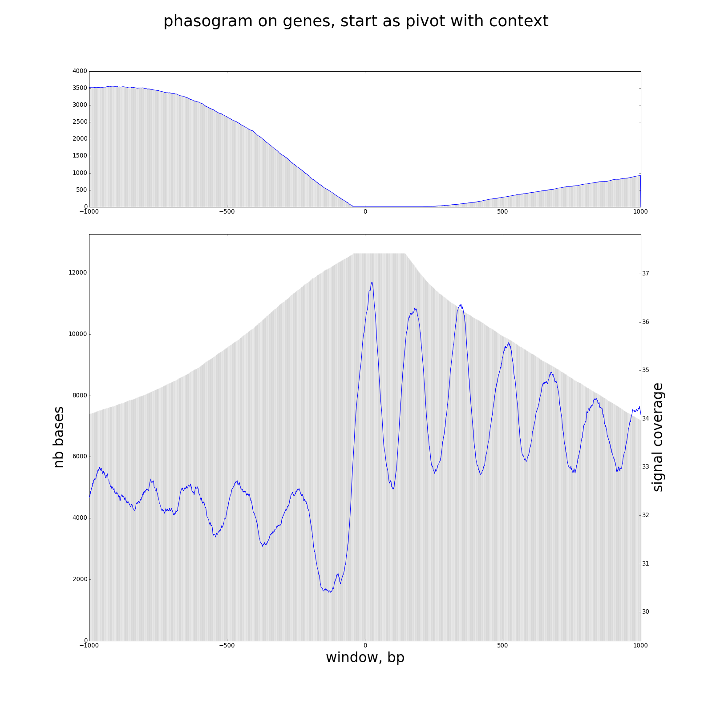
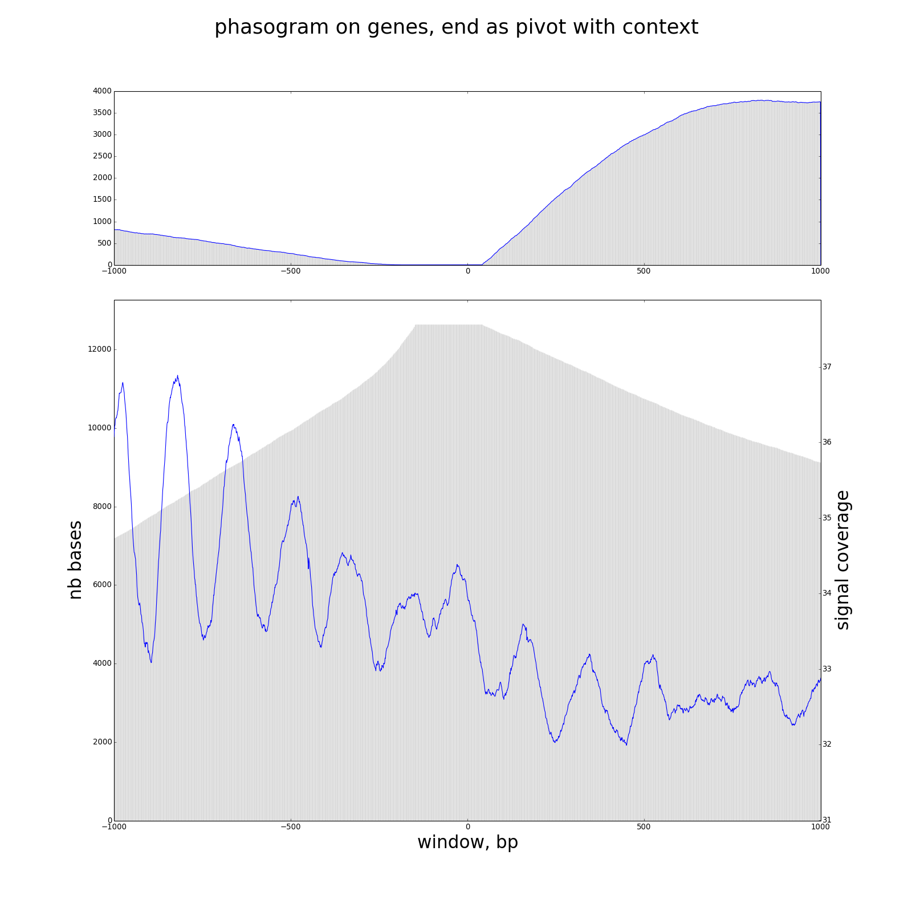
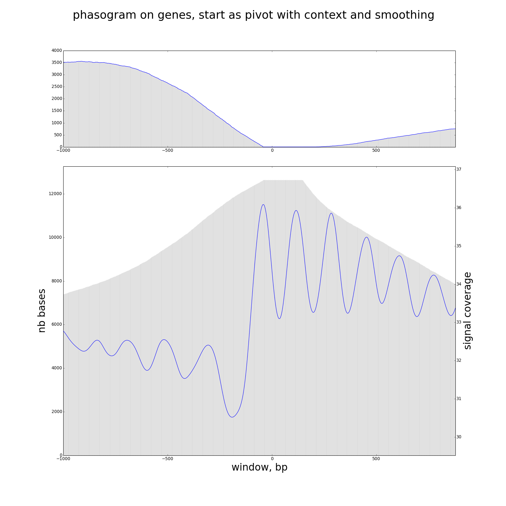
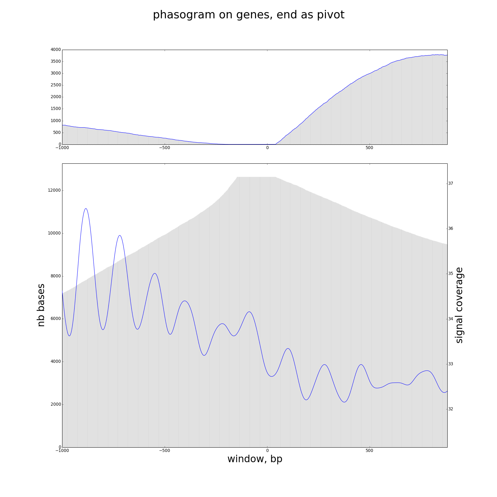

# MSTS_feature_phasogram.py

This script allows you to draw a phasogram from a bigWig file on specific features.

## Usage and options

### Usage:

`MSTS_feature_phasogram.py input.bw genes.gff3 -v 2 -o myfeaturephasogram.png -t "phasogram on genes, start as pivot"`

or 

`MSTS_feature_phasogram.py input.bw genes.gff3 -v 2 -o myfeaturephasogram.png -t "phasogram on genes, end as pivot, with context, with smoothing" -p end --context --GaussianSmoothing`

### Options:

| Option | Description |
| ------ | ----------- |
| `-wb, --windowBefore` | window size to analyze before the feature,default=1000 |
| `-wa, --windowAfter` | window size to analyez after the feature, default=1000 |
| `-ft, --featureType` | feature type to analyze, default=gene |
| `-p, --pivot` | feature bound to use, default=start, possible values=[start,end] |
| `--context` | if set, defined features in context matter |
| `-o, --out` | name of output graph |
| `-t, --title` | title text |
| `-x, --xax` | x axis text |
| `-y, --yax` | y axis text |
| `-d, --sqliteDB` | provide sqlite DB to avoid insertion, usefull for multi-analysis |
| `-n, --noDeleteDB` | Do not delete SQLite DB |
| `-s, --GaussianSmoothing` | Perform Gaussian Smoothing on data |
| `-w, --windowWidth` | window size for Gaussian smoothing, default=3 |
| `-sd, --stdev` | stdev for Gaussian smoothing, default=20 |
| `-v, --verbosity` | increase output verbosity 1=error, 2=info, 3=debug |
| `--version` | tool suite version |
| `-h, --help` | help message |

## Outputs

#### simple phasogram on gene (start and end)
 {:height="36px" width="36px"}

#### phasogram with context (--context)
 

#### phasogram with gaussian smoothing (--GaussianSmoothing)
 
