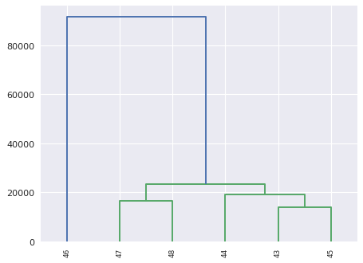
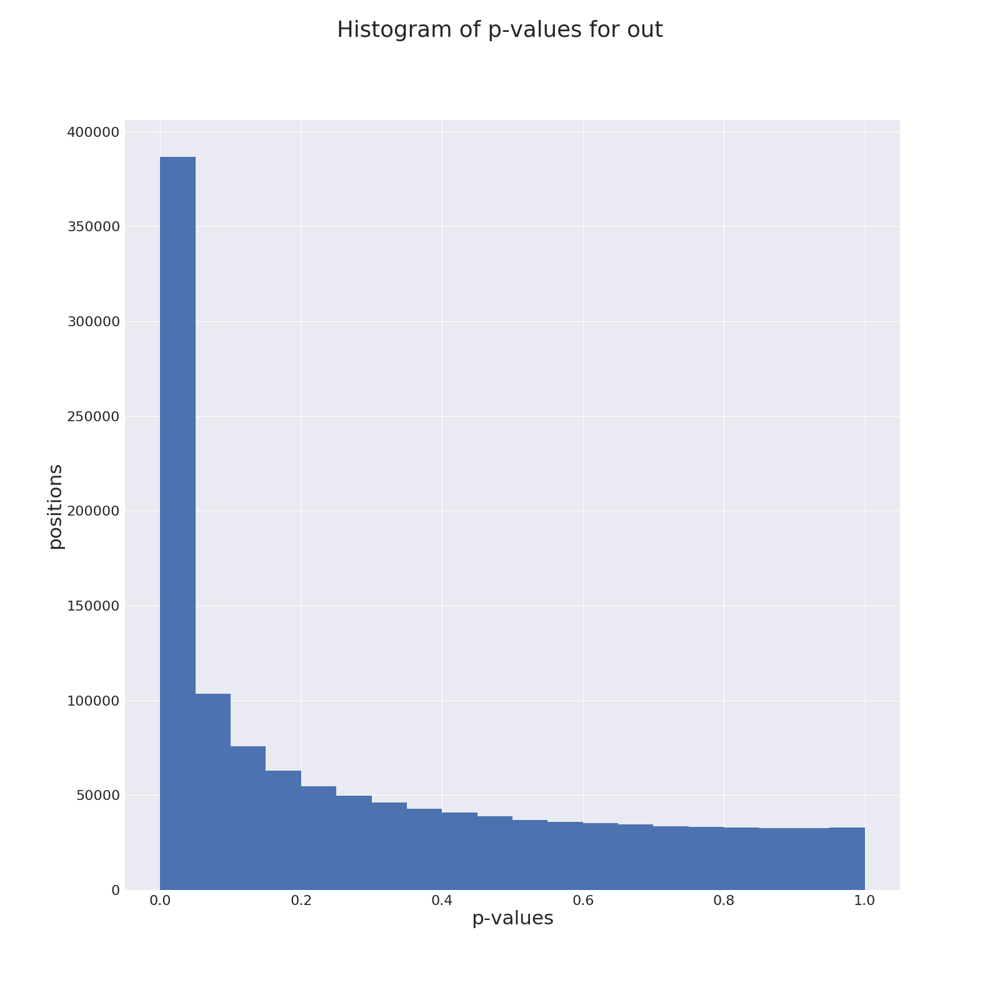

# MSTS_nucleosome_difference.py

This tool analyzes the signal difference between 2 conditions of Mnase-seq. Several replicats can be use, in this case the average signal is used in the analyses. The coefficient of variation is reported for each conditon to filer-out too divergent replicat. In the same manner, we perform a hierarchical clustering on raw and normalized data to validate each replicat.     
 

## Usage and options

### Usage:

`MSTS_nucleosome_difference.py list.txt`

or

`MSTS_nucleosome_difference.py list.txt -v 2 -p C1vsC2 -f 1.5 -a 0.01 --bed --merge` 


### Arguments:

| Argument | Description |
| --------- | ----------- |
| `list.txt` | design file with list of conditions and replicats |

### Options:

| Option | Description |
| ------ | ----------- |
| `-p, --prefix` | prefix for output files, default=[out.] |
| `-a, --alpha` | alpha risk threshold to output results, default=0.05 |
| `-f FC, --fc FC` | Fold Change to output results, default=2.0 |
| `-t THRESHOLD, --threshold` | Miminal sum of counts per condition to analyze position, default=5 |
| `-n NORM, --norm` | Normalization method: quantile or scale, default=quantile |
| `-y NUCTYPE, --nuctype` | Nucleosome type to analyze, inclusive mode: very-well, well, fuzzy, bad, default=fuzzy |
| `--bed` | export differential positions in bed file |
| `--merge` | In case of several replicats with different peaks, positions could be merge to propose a differential area instead of several unique positions, default=False |
| `-v, --verbosity` | increase output verbosity 1=error, 2=info, 3=debug |
| `--version` | tool version |
| `-h, --help` | help message |

## Inputs:

The list.txt file contains the design of your test with links to the data: nucleosome files obtained with MSTS_detect_nucleosomes.py and bigwig files from MSTS_converter.py 

```
#condition	label	nucfile	bigwigfile
c1	43	43.nucleosomes.txt	43.mapping.bw
c1	44	44.nucleosomes.txt	44.mapping.bw
c1	45	45.nucleosomes.txt	45.mapping.bw
c2	46	46.nucleosomes.txt	46.mapping.bw
c2	47	47.nucleosomes.txt	47.mapping.bw
c2	48	48.nucleosomes.txt	48.mapping.bw
```

## Outputs:

#### out.diff


```
#ref	pos	mean1	CV1	mean2	CV2	FC	pval	paj
SEQ10	708598	16.2	21.9	2.7	48.7	0.16	7.12e-08	7.45e-06
SEQ14	253307	13.9	22.5	2.7	31.9	0.19	1.64e-06	8.95e-05
SEQ18	129813	14.2	40.1	2.9	10.9	0.20	2.25e-06	1.14e-04
SEQ18	125906	29.6	55.5	6.1	21.4	0.20	8.39e-12	4.10e-09
SEQ12	30014	10.7	37.7	2.2	74.1	0.21	4.28e-05	1.07e-03
SEQ18	125912	30.2	69.4	6.3	7.6	0.21	7.18e-12	3.60e-09
SEQ05	2586933	10.6	20.9	2.3	52.2	0.21	5.81e-05	1.35e-03
SEQ16	436879	72.4	26.0	15.7	22.7	0.22	1.10e-25	5.24e-22
SEQ01	3531964	50.8	22.2	11.1	5.0	0.22	2.14e-18	5.00e-15
SEQ18	125909	30.1	63.3	6.7	16.2	0.22	2.66e-11	1.09e-08
...
```

#### hierarchical cluster plots

We perform a hierarchical clustering of raw and normalized data. For each clustering we export a dendogram to analyze the homogeneity of replicats vs conditions. 

_hierarchical clustering of raw data_

 

_hierarchical clustering of normalized data_

 

#### p-values plot

We plot the distribution of p-values to validate the test assumptions. For more explanation see this [page](:http://varianceexplained.org/statistics/interpreting-pvalue-histogram/)

 

#### bed file (--bed)

You get a bed file with each differential positions. You can then load these bed files in your browser.

#### merge bed file (--bed and --merge)

You get a bed file with merged differential positions in a single area if they have a maximum distance of 30bp.


