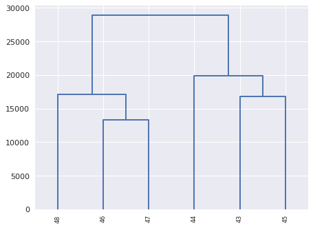

# MSTS_nucleosome_difference.py

This tool analyzes the signal difference between 2 conditions of Mnase-seq. Several replicats can be use, in this case the average signal is used to  
 

## Usage and options

### Usage:

`MSTS_nucleosome_difference.py list.txt`

or

`MSTS_nucleosome_difference.py list.txt -v 2 -p C1vsC2 -f 1.5 -a 0.01 --bed --merge` 


### Arguments:

| Argument | Description |
| --------- | ----------- |
| `list.txt` | design file with list of conditions and replicats |

### Options:

| Option | Description |
| ------ | ----------- |
| `-p, --prefix` | prefix for output files, default=[out.] |
| `-a, --alpha` | alpha risk threshold to output results, default=0.05 |
| `-f FC, --fc FC` | Fold Change to output results, default=2.0 |
| `-t THRESHOLD, --threshold` | Miminal sum of counts per condition to analyze position, default=5 |
| `-n NORM, --norm` | Normalization method: quantile or scale, default=quantile |
| `-y NUCTYPE, --nuctype` | Nucleosome type to analyze, inclusive mode: very-well, well, fuzzy, bad, default=fuzzy |
| `--bed` | export differential positions in bed file |
| `--merge` | In case of several replicats with different peaks, positions could be merge to propose a differential area instead of several unique positions, default=False |
| `-v, --verbosity` | increase output verbosity 1=error, 2=info, 3=debug |
| `--version` | tool version |
| `-h, --help` | help message |

## Inputs:

The list.txt file contains the design of your test with links to the data: nucleosome files obtained with MSTS_detect_nucleosomes.py and bigwig files from MSTS_converter.py 

```
#condition	label	nucfile	bigwigfile
c1	43	43.nucleosomes.txt	43.mapping.bw
c1	44	44.nucleosomes.txt	44.mapping.bw
c1	45	45.nucleosomes.txt	45.mapping.bw
c2	46	46.nucleosomes.txt	46.mapping.bw
c2	47	47.nucleosomes.txt	47.mapping.bw
c2	48	48.nucleosomes.txt	48.mapping.bw
```

## Outputs:

#### out.diff


```
#ref	pos	mean1	CV1	mean2	CV2	FC	pval	paj
SEQ02	2382351	18.5	0.453503169321	4.83333333333	0.29663190576	0.261261261261	9.55657641707e-07	5.30708543695e-05
SEQ10	1502549	94.8333333333	0.0880957937213	25.0555555556	0.0385324771552	0.264206209725	2.49946305688e-28	8.32821090553e-25
SEQ16	478522	76.2777777778	0.159033448893	26.3888888889	0.251065320213	0.345957756737	1.4851526835e-17	2.47426437071e-14
SEQ11	1412239	25.5	0.396382462747	9.05555555556	0.541269815954	0.355119825708	1.26326903538e-06	6.75274720728e-05
SEQ06	2496039	15.6666666667	0.405652680105	5.61111111111	0.528197174984	0.358156028369	0.000159452489247	0.00275759010816
SEQ02	487219	87.5555555556	0.212336988236	31.4444444444	0.0757454102835	0.359137055838	5.13034431216e-19	1.02565843489e-15
SEQ09	1719789	63.0	0.192825507938	23.0	0.0709997026894	0.365079365079	7.95261290156e-14	8.83270206266e-11
SEQ04	549329	47.1111111111	0.0405770059766	17.3333333333	0.102664213962	0.367924528302	1.31864599158e-10	4.54523632134e-08
SEQ03	1429328	64.5	0.0670176181358	24.0555555556	0.155987480746	0.372954349699	9.74442223612e-14	9.74052446722e-11
...
```

#### hierarchical cluster plots

We perform a hierarchical clustering of raw and normalized data. For each clustering we export a dendogram to analyze the homogeneity of replicats vs conditions. 

_hierarchical clustering of raw data_
 
_hierarchical clustering of normalized data_
 


#### bed file (--bed)

You get a bed file with each differential positions. You can then load these bed files in your browser.

#### merge bed file (--bed and --merge)

You get a bed file with merged differential positions in a single area if they have a maximum distance of 30bp.


