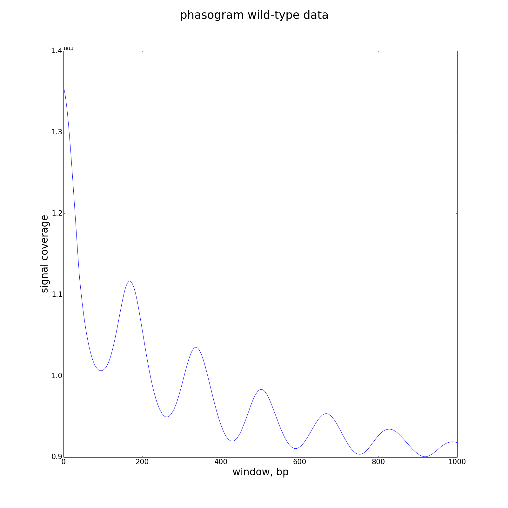
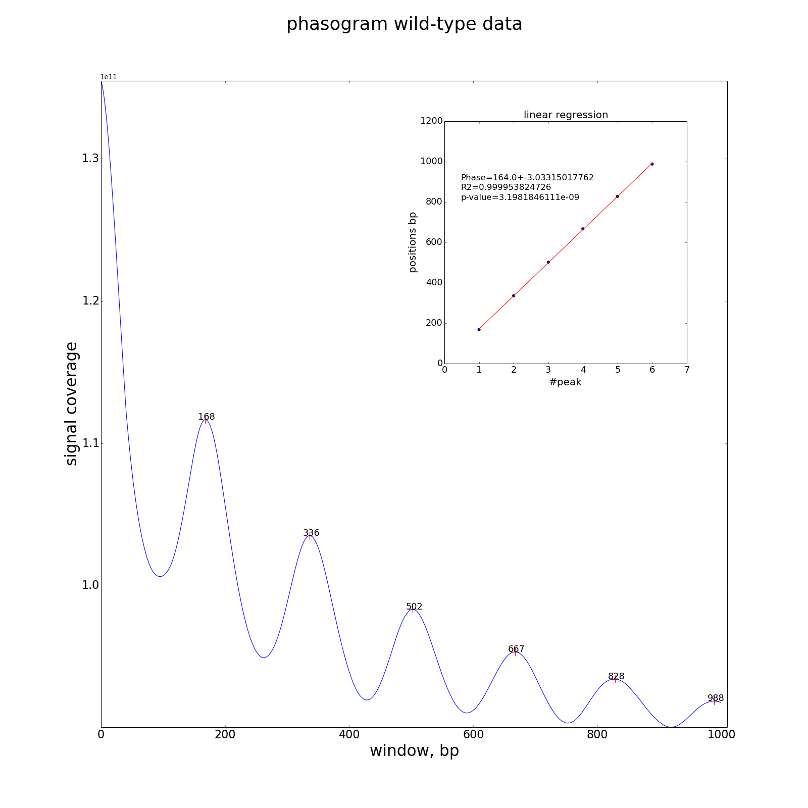

# MSTS_phasogram.py

This script allows you to draw a phasogram from a bigWig file.

## Usage and options

### Usage:

`MSTS_phasogram.py input.bw -w 1000 -o myphasogram.png -t "phasogram wild-type data" -v 2`
or 
`MSTS_phasogram.py set2.lmb40.bw  -w 1000 -o myphasogram.png -t "phasogram wild-type data" -v 2  --flush --regression`

### Options:

| Option | Description |
| ------ | ----------- |
| `-w, --window` | window size to compute phases |
| `--flush` | print phases on stdout to save in file, > phases.out |   
| `--regression` | detect peaks and perform a regression. Regression curve drawn on the graph |
| `-o, --out` | name of output graph |
| `-t, --title` | title text |
| `-x, --xax` | x axis text |
| `-y, --yax` | y axis text |
| `-v, --verbosity` | increase output verbosity 1=error, 2=info, 3=debug |
| `--version` | tool suite version |
| `-h, --help` | help message |

## Outputs

#### simple phasogram

#### phasogram (--regression)

